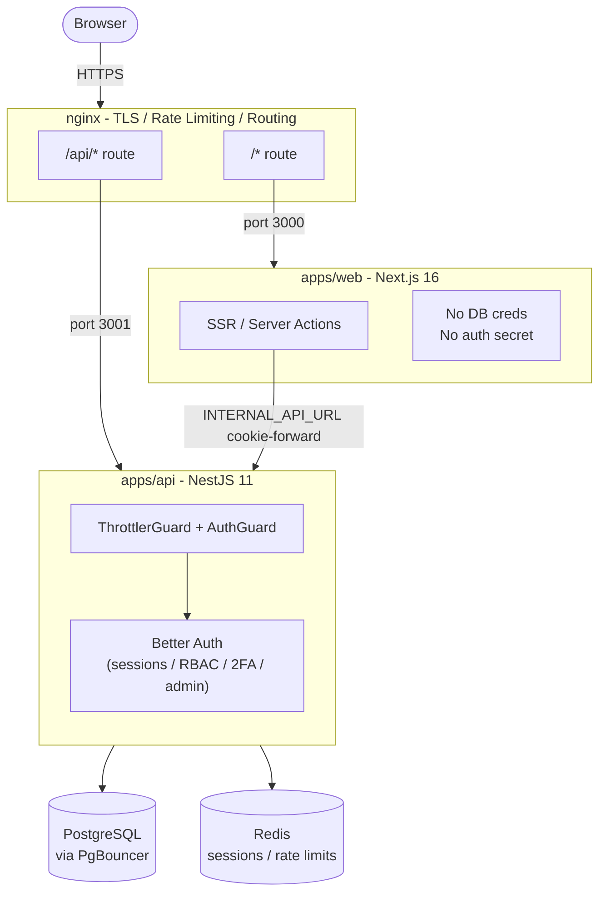
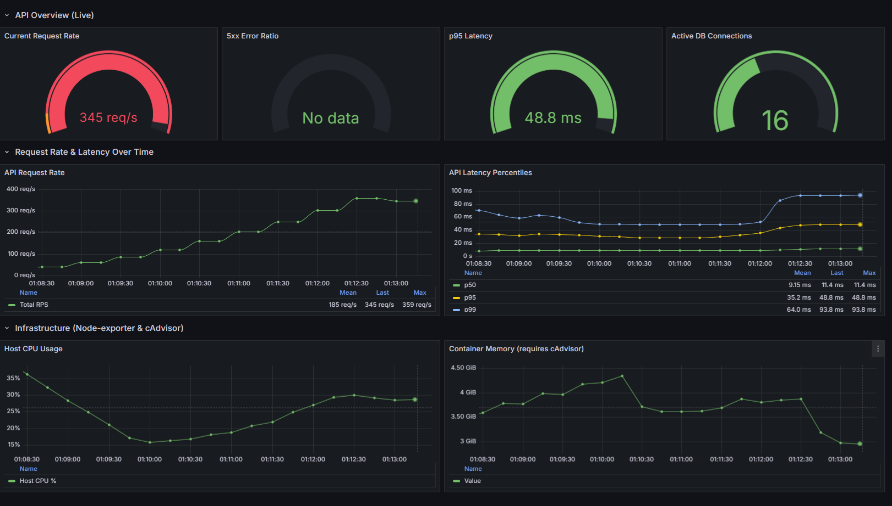
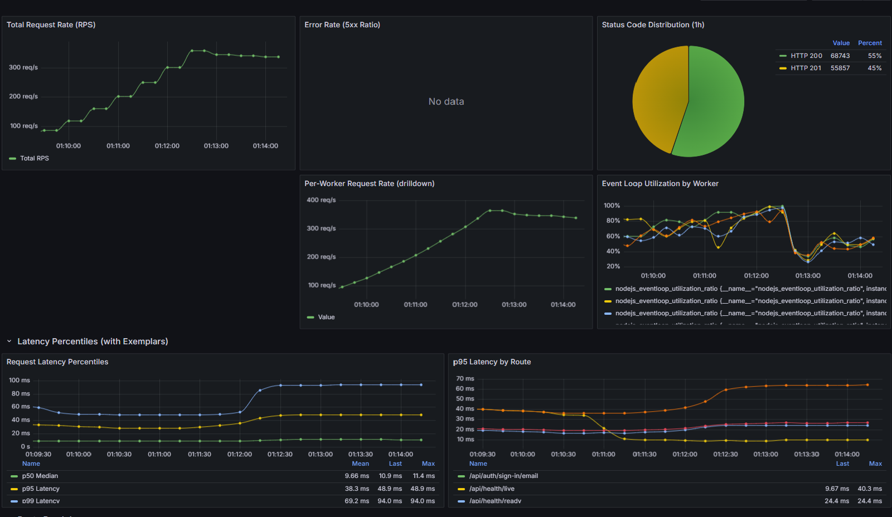
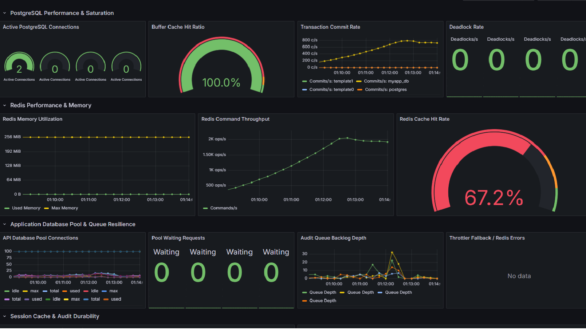
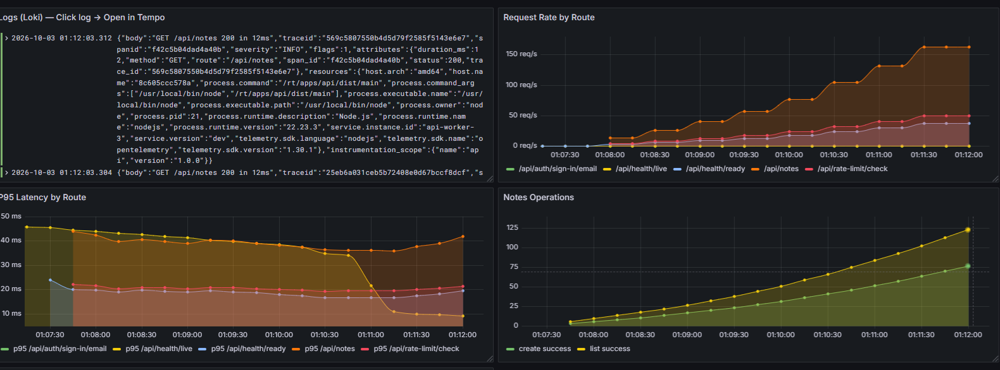

<div align="center">

# Template Turbo Repo

**A production-ready full-stack monorepo template** — Next.js, NestJS, Better Auth, Prisma 7, PostgreSQL, Redis, nginx, and a full Grafana observability stack, all wired together with Turborepo and Docker Compose.

<br/>

<!-- Core stack -->
&nbsp;
&nbsp;
&nbsp;
&nbsp;
&nbsp;
&nbsp;
&nbsp;
&nbsp;
&nbsp;
&nbsp;
&nbsp;


<br/>

<!-- Testing & tooling -->
&nbsp;
&nbsp;
&nbsp;


<br/><br/>

[](https://nodejs.org)
[](https://pnpm.io)
[](https://turbo.build)
[](https://www.better-auth.com)
[](https://www.prisma.io)
[](./LICENSE)

</div>v>

---

## Start here

Scaffold a new project with one command. No clone, no GitHub, no setup:

```bash
npx create-turbo-template-app my-app
```

That's it. You get a working full-stack app with authentication, RBAC, rate
limiting, audit logging, a database, Redis, nginx, and a full Grafana
observability stack — plus the `docs/wiki/` knowledge base so an AI coding
agent (Claude Code, Cursor, Codex, opencode…) can work in it from day one.

```
my-app/
├── apps/
│   ├── api/         NestJS 11 — Better Auth, RBAC, rate limits, audit
│   ├── web/         Next.js 16 — auth pages, dashboard, admin panel
│   └── migrate/     Isolated migration runner
├── packages/        auth · database · roles · api · ui · observability · configs
├── docs/wiki/       10 invariants · 7 flows · 17 subsystems · 9 workflows
├── observability/   Alloy · Prometheus · Loki · Tempo · Pyroscope · Grafana
├── k6/              7 load-test suites
└── AGENTS.md        AI agent entry point → docs/wiki/00-INDEX.md
```

Everything is renamed to your project: npm scope (`@my-app/*`), root package
name, Postgres user/database, `APP_NAME`, and the Docker Compose project name.
`.env.example` arrives with your identity already filled in.

<details>
<summary>Options and flags</summary>

```bash
npx create-turbo-template-app                       # interactive
npx create-turbo-template-app my-app                # non-interactive name
npx create-turbo-template-app "My Awesome App"      # normalized to my-awesome-app
npx create-turbo-template-app my-app --scope @acme  # custom internal scope
npx create-turbo-template-app my-app --skip-install # copy only, no pnpm install
npx create-turbo-template-app my-app --dry-run      # show the plan, change nothing
```

| Flag | Meaning |
|------|---------|
| `--project-name <name>` | directory + root `package.json` name |
| `--scope <scope>` | internal workspace scope (default `@<name>`) |
| `--destination <path>` | output directory (default `./<name>`) |
| `--yes`, `-y` | skip all prompts |
| `--skip-install` | copy + transform, skip `pnpm install` |
| `--no-git` | skip `git init` |
| `--allow-existing` | write into a non-empty directory (never deletes) |
| `--dry-run` | print the plan, make no changes |
| `--skip-validation` | skip post-generation validation |
| `--skip-build` | validate everything except `build` |
| `--verbose` | log every transformed file |

After scaffolding:

```bash
cd my-app
cp .env.example .env        # fill in BETTER_AUTH_SECRET, passwords, SEED_ADMIN_*
docker compose --profile local up -d
pnpm db:generate && pnpm db:migrate:dev
pnpm dev                    # https://localhost
```

The scaffolder runs `pnpm install --frozen-lockfile`, then validates the result
(typecheck, lint, unit tests, build, both architecture guards) before reporting
success. Full policy and rationale: [docs/SCAFFOLD.md](docs/SCAFFOLD.md).

</details>

---

## What is this?

This is a **batteries-included monorepo template** that gives you a production-grade starting point for a full-stack TypeScript application. Instead of spending weeks wiring together authentication, observability, database access, rate limiting, and deployment — it is all done, tested, and documented.

You get a working application with:
- A **NestJS API** with Better Auth, RBAC, rate limiting, and audit logging
- A **Next.js frontend** with authentication pages, dashboard, and admin panel
- **Three Docker run modes** (local dev, hot-reload containers, production containers)
- A **full Grafana observability stack** (metrics, logs, traces, profiling, RUM)
- **k6 load testing** suite with seven suites (smoke, load, stress, spike, soak, capacity, edge) — [measured at 600 req/s, p95 ≈ 49 ms, zero 5xx](#capacity-report--measured-not-claimed)
- **Playwright E2E tests** and **Jest integration tests** — all isolated
- A **LLM wiki** in `docs/wiki/` designed for AI coding agents

---

## Tech Stack

| Layer | Technology |
|-------|-----------|
| **Monorepo** | [Turborepo 2.x](https://turbo.build) + [pnpm 11](https://pnpm.io) workspaces |
| **Frontend** | [Next.js 16](https://nextjs.org) (App Router) + [React 19](https://react.dev) |
| **Backend API** | [NestJS 11](https://nestjs.com) + Express adapter |
| **Authentication** | [Better Auth 1.6](https://www.better-auth.com) — email/password + OAuth + 2FA + admin |
| **Database ORM** | [Prisma 7](https://www.prisma.io) with `@prisma/adapter-pg` (native PostgreSQL driver) |
| **Database** | [PostgreSQL 16](https://www.postgresql.org) |
| **Connection Pool** | [PgBouncer](https://www.pgbouncer.org) (transaction mode) |
| **Cache / Sessions** | [Redis 7](https://redis.io) via [ioredis](https://github.com/redis/ioredis) |
| **Reverse Proxy** | [nginx](https://nginx.org) (TLS termination, rate limiting, routing) |
| **Observability** | [Grafana Alloy](https://grafana.com/docs/alloy) + [Prometheus](https://prometheus.io) + [Loki](https://grafana.com/docs/loki) + [Tempo](https://grafana.com/docs/tempo) + [Pyroscope](https://grafana.com/docs/pyroscope) + [Grafana](https://grafana.com) |
| **Browser RUM** | [Grafana Faro](https://grafana.com/docs/grafana-cloud/monitor-applications/frontend-observability) |
| **Load Testing** | [k6](https://k6.io) (7 suites: smoke, load, stress, spike, soak, capacity, edge) |
| **E2E Testing** | [Playwright](https://playwright.dev) |
| **Unit/Integration Testing** | [Jest](https://jestjs.io) |
| **Container Runtime** | [Docker](https://www.docker.com) + [Docker Compose](https://docs.docker.com/compose) |
| **Email** | [Resend](https://resend.com) |
| **Language** | [TypeScript 5.9](https://www.typescriptlang.org) |

---

## Architecture at a glance



> **Architecture B — secret-free web tier:** The Next.js container holds **no** database credentials and **no** auth signing secret. All server-side auth operations forward cookies to the API. CI guards (`pnpm guard:web-secrets`) enforce this boundary.

---

## Documentation

| Document | Description |
|----------|-------------|
| [docs/GETTING_STARTED.md](docs/GETTING_STARTED.md) | **Start here** — prerequisites, env setup, all run modes, seeding, testing |
| [docs/GUIDE.md](docs/GUIDE.md) | Developer guide — monorepo structure, packages, RBAC, rate limiting, audit, observability |
| [docs/ARCHITECTURE.md](docs/ARCHITECTURE.md) | Architecture diagrams, Docker profiles, service startup order, security boundaries |
| [docs/CODEBASE.md](docs/CODEBASE.md) | AI agent reference — file-by-file breakdown, API endpoints, env vars, business logic |
| [docs/wiki/00-INDEX.md](docs/wiki/00-INDEX.md) | **LLM wiki entry point** — task router for AI agents |
| [docs/wiki/00-GLOSSARY.md](docs/wiki/00-GLOSSARY.md) | Glossary — homonym pairs and disambiguation |
| [docs/SCAFFOLD.md](docs/SCAFFOLD.md) | How the npm package and the scaffolder work |

---

## Quick start (working on the template itself)

> Most people should use `npx create-turbo-template-app my-app` instead — see
> **Start here** above. The steps below are for developing the template itself.

### Prerequisites

- Node.js >= 20 (`engines`), 22 in CI
- pnpm 11 (`corepack enable`)
- Docker Desktop
- mkcert (for local TLS)

### 1. Install

```bash
corepack enable
pnpm install
```

### 2. Configure environment

```bash
cp .env.example .env
# Edit .env: set BETTER_AUTH_SECRET, passwords, and SEED_ADMIN_* values
```

### 3. Generate TLS certificate

```bash
mkcert -install
mkcert -key-file nginx/certs/localhost.key -cert-file nginx/certs/localhost.crt localhost 127.0.0.1
```

### 4. Run (local mode — recommended)

```bash
# Start infrastructure in Docker
docker compose --profile local up -d

# Start apps on host (hot reload)
pnpm dev

# Generate DB client and apply migrations
pnpm db:generate
pnpm db:migrate:dev

# Seed the admin user (API must be running)
pnpm db:seed
```

Open **https://localhost** in your browser.

> See [docs/GETTING_STARTED.md](docs/GETTING_STARTED.md) for all run modes including full Docker dev/prod and observability.

---

## Run modes

| Mode | Command | Best for |
|------|---------|---------|
| **local** — infra in Docker, apps on host | `docker compose --profile local up -d` + `pnpm dev` | Day-to-day development |
| **dev** — everything in Docker, hot reload | `docker compose --profile dev up --build` | Reproducing prod environment locally |
| **prod** — full production stack | `docker compose --profile prod up --build -d` | Staging / production-like testing |
| **+ observability** | Add `-f docker-compose.observability.yml` to any mode | Metrics, logs, traces, profiling |

---

## Monorepo structure

```
apps/
  api/          NestJS API — Better Auth, RBAC, rate limiting, audit
  web/          Next.js frontend — auth pages, dashboard, admin panel
  migrate/      Migration runner container

packages/
  auth/         @repo/auth — Better Auth config, RBAC, plugins, email
  database/     @repo/database — Prisma schema, client, migrations, seed
  roles/        @repo/roles — role utilities, SERVER_ACTION_SCOPES
  api/          @repo/api — shared TypeScript types
  ui/           @repo/ui — shared React components
  observability/ @repo/observability — OTel/pino logging helpers
  eslint-config/ @repo/eslint-config
  jest-config/   @repo/jest-config
  tailwind-config/ @repo/tailwind-config
  typescript-config/ @repo/typescript-config

k6/             Load test suites (smoke, load, stress, spike, soak, edge)
nginx/          Reverse proxy config and TLS certs
observability/  Grafana stack configs (Alloy, Prometheus, Loki, Tempo, Pyroscope, Grafana)
pgbouncer/      Connection pooler config
docs/           Documentation and LLM wiki
scripts/        Scaffolder, architecture guards, publish tooling
```

---

## Key commands

```bash
# Development
pnpm dev                          # start all apps + package watchers
pnpm build                        # build everything
pnpm lint                         # ESLint
pnpm typecheck                    # TypeScript type check

# Database
pnpm db:generate                  # generate Prisma client
pnpm db:migrate:dev               # create + apply migration (interactive)
pnpm db:migrate:deploy            # apply existing migrations (CI-safe)
pnpm db:seed                      # seed the admin user
pnpm db:studio                    # open Prisma Studio

# Auth schema
pnpm auth:generate                # sync Better Auth -> betterAuth.prisma

# Testing
pnpm test                         # unit tests (no infra needed)
pnpm --filter api test:integration # integration tests
pnpm --filter web test:e2e        # Playwright E2E

# Load testing
pnpm k6:smoke                     # smoke test
pnpm k6:load                      # load test
pnpm k6:stress                    # stress test

# Guards (run before committing)
pnpm guard:web-secrets
pnpm guard:web-auth-imports
pnpm guard:publish-contents   # audits the npm tarball: no secrets, no artifacts

# Scaffold tooling
pnpm scaffold                 # generate a new project from this checkout
pnpm scaffold:test            # scaffolder test suite (also runs in CI)
```

---

## Authentication features

Better Auth provides out of the box (configured in `packages/auth/src/server/auth.ts`):

- Email + password sign-up / sign-in with **email verification**
- **Two-factor authentication** — TOTP (authenticator app) + OTP (email) + backup codes
- **OAuth** — Google and GitHub (configure client IDs in `.env`)
- **Admin panel** — user management, role assignment, banning, impersonation, session revocation
- **JWT tokens** — ES256, 30-minute expiry, 30-day rotation with 7-day grace period
- **Account linking** — merge OAuth accounts by email
- **Session management** — DB-backed + Redis secondary storage

### Role hierarchy

| Role | Access |
|------|--------|
| `superAdmin` | Full access; can act on all roles |
| `admin` | Can manage operators and users |
| `operator` | Can manage users |
| `user` | Standard authenticated user |

---

## auth:generate — how it works

```bash
pnpm auth:generate
```

This command reads your Better Auth config (`packages/auth/src/auth.ts`), introspects all active plugins, and generates the corresponding Prisma model file (`packages/database/prisma/models/betterAuth.prisma`).

**You never hand-write the auth tables** — the CLI generates them from your config. After running it:

```bash
pnpm auth:generate        # updates betterAuth.prisma
pnpm db:migrate:dev       # create migration from diff
pnpm db:generate          # rebuild Prisma client
```

To customise auth, **edit `packages/auth/src/auth.ts`** — not `betterAuth.prisma` directly.

---

## Observability

Add `-f docker-compose.observability.yml` to any Docker run command:

```bash
docker compose -f docker-compose.yml -f docker-compose.observability.yml --profile local up -d
```

| Dashboard | URL |
|-----------|-----|
| **Grafana** | http://localhost:3002 |
| **Prometheus** | http://localhost:9091 |
| **Alloy UI** | http://localhost:12345 |

The stack collects:
- **Metrics** — HTTP request rates, latencies, error rates, DB pool usage, Redis ops
- **Logs** — Structured JSON from API, web, and nginx (via Alloy)
- **Traces** — Distributed tracing across API and web (via OTel + Tempo)
- **Profiles** — Continuous CPU/memory profiling from API (via Pyroscope)
- **RUM** — Real User Monitoring from browsers (via Grafana Faro)

---

## Capacity report — measured, not claimed

> Reproduced end-to-end on this repo: Docker Compose `prod` + full observability
> stack, hammered with the `k6` capacity suite, and observed live in Grafana.
> Screenshots below are from **that** run.

### TL;DR — what one container handles on average

| Metric | Measured | Verdict |
|--------|----------|---------|
| **Sustained throughput (client-observed)** | **600 req/s** for 5 min, `dropped_iterations = 0` | PASS - target rate met every second |
| **Error rate (5xx)** | **0 %** | PASS - clean |
| **p50 latency** | **11.4 ms** | PASS |
| **p95 latency** | **48.8 ms** | PASS |
| **p99 latency** | **93.8 ms** | PASS |
| **Event-loop utilisation (ELU)** | peaked at **~95-100 %** of one worker | WATCH - CPU-saturated |
| **Host CPU** | peaked at **~30 %** of 16 logical cores | WATCH - API was *not* the bottleneck |
| **Postgres connections** | **16 active**, `pool_waiting = 0` | PASS - I/O-bound, not conn-bound |
| **Postgres deadlocks** | **0** | PASS |
| **Redis command rate** | **~2,000 ops/s**, 67 % hit ratio | PASS |

**The honest one-line answer:**

> This stack comfortably serves **~600 requests/second** (≈ **36,000 req/min**)
> with **p95 ≈ 49 ms**, **zero 5xx**, and **zero dropped iterations** on a single
> `api` container (4 Node workers) on a **10-core / 16-thread** laptop — while
> using only ~30 % of host CPU and 16 of 200 Postgres connections.
>
> Because the API saturates one event loop (ELU ~100 %) long before Postgres or
> Redis do, **600 req/s is a single-container number, not a machine limit.** Scale
> with `API_WORKERS` / more replicas — the database has ~12× headroom left.

### Why "average capacity" needs one caveat

k6 reports **600 iters/s achieved**, but the Grafana panels below top out at
**~359 req/s**. That is not a contradiction — it is a measurement artifact you
should understand before you trust either number:

- Every dashboard panel uses `rate(...[5m])`, a **5-minute sliding window**
  (`observability/grafana/dashboards/*.json`), and Prometheus scrapes every
  **15 s**. A 5-minute average of a 200 → 600 RPS ramp is ~350–360, which is
  exactly what the panels show.
- **Use k6's number (600 iters/s, 0 dropped) as the throughput ceiling.** It is
  measured at the client, per second, with no smoothing.
- **Use the Grafana numbers for shape** — latency percentiles, ELU, pool
  pressure, error ratio — which are unaffected by the smoothing.

### How it was run

```bash
# 1. Full production-like stack + every observability service
docker compose --env-file .env.k6 \
  -f docker-compose.yml \
  -f docker-compose.observability.yml \
  --profile prod up -d --build

# 2. Stepped arrival-rate probe: 200 → 300 → 400 → 500 → 600 RPS, 60 s each
pnpm k6:capacity

# 3. Watch it live in Grafana (admin / admin)
open http://localhost:3002
```

Workload mix (`k6/config.js` → `TRAFFIC_MIX.capacity`), read-heavy and
notes-biased, which is what a real dashboard looks like:

| Share | Operation | Endpoint |
|-------|-----------|----------|
| 40 % | DB read | `GET /api/notes?limit=10&withTotal=false` |
| 25 % | DB write | `POST /api/notes` |
| 20 % | Redis | `POST /api/rate-limit/check` |
| 15 % | Health | `GET /api/health/ready` |

### Test rig

| Component | Value |
|-----------|-------|
| Host | Intel Core i5-14450HX — 10 cores / 16 threads, 15.7 GB RAM |
| `api` | 1 container, `API_WORKERS=4`, `DATABASE_POOL_MAX=100` per worker |
| PgBouncer | transaction mode, max 2000 clients, default pool 70 + reserve 10 |
| PostgreSQL | `max_connections=200`, `shared_buffers=768MB`, `work_mem=16MB` |
| Rate limits | nginx zones opened for a single-IP generator (2000 r/s API) |
| k6 | v2.2.0, `grafana/k6:0.57.0` fallback, TLS verify skipped (local mkcert) |

---

### Screenshot 1 - System Overview (live)

The four headline gauges at peak. **345 req/s instantaneous, p95 48.8 ms, only
16 DB connections, and the 5xx gauge reading "No data"** — i.e. not a single
server error was recorded during the entire run.



Reading the panels:

| Panel | Mean | Last | Max |
|-------|------|------|-----|
| Total RPS | 185 req/s | 345 req/s | **359 req/s** |
| p50 latency | 9.15 ms | 11.4 ms | 11.4 ms |
| p95 latency | 35.2 ms | 48.8 ms | 48.8 ms |
| p99 latency | 64.0 ms | 93.8 ms | 93.8 ms |
| Host CPU | — | ~29 % | ~30 % |
| Container memory | — | ~2.95 GiB | ~4.35 GiB |

The latency curve is the important part: it stays **flat** while RPS climbs from
~40 to ~360. **Latency did not degrade as throughput rose** — that is the
signature of a system with real headroom rather than one that is merely
surviving. Host CPU never exceeds 30 %, so nothing on the host was throttling.

---

### Screenshot 2 - API Performance (RED + event-loop utilisation)

Status-code distribution, per-worker drilldown, and the ELU panel that explains
*why* the ceiling is where it is.



- **Status Code Distribution (1h):** `HTTP 200 = 68,743 (55 %)`,
  `HTTP 201 = 55,857 (45 %)`. **Zero 4xx, zero 5xx.** The 55/45 split is exactly
  the read/write mix the suite injects (40 % reads + 15 % health = 55 % `200`,
  25 % writes = 45 % `201`) — the load generator did precisely what it claimed.
- **Error Rate (5xx Ratio): "No data"** — no 5xx samples were ever recorded.
- **Per-Worker Request Rate:** climbs smoothly to **~360 req/s aggregate**, so
  work is being spread across the cluster workers, not pinned to one.
- **Event Loop Utilization by Worker:** each of the 4 workers rides up to
  **~95–100 %** during the ramp, then drops back to ~50 % when the ramp ends.
  **This is the actual bottleneck.** The API is CPU/event-loop bound.
- **Request Latency Percentiles:** p50 `9.66 / 10.9 / 11.4 ms`,
  p95 `38.3 / 48.9 / 48.9 ms`, p99 `69.2 / 94.0 / 94.0 ms` (mean / last / max).

> **Why ELU is the thing to watch here:** per
> `docs/wiki/invariants`, the template ships `API_WORKERS` for exactly this
> reason — a single Node event loop saturates before the database does. Cluster
> workers (or replicas) are the correct lever; buying a bigger `DATABASE_POOL_MAX`
> would not have helped.

---

### Screenshot 3 - Database, Redis & pool resilience

Where the same 600 req/s looks like *nothing at all*.



| Signal | Value | Meaning |
|--------|-------|---------|
| **Buffer Cache Hit Ratio** | **100.0 %** | Entire hot working set lives in `shared_buffers`; almost no physical reads |
| **Active PostgreSQL Connections** | **2 active**, rest idle | PgBouncer is multiplexing aggressively — 16 client conns → 2 server conns |
| **Deadlock Rate** | **0 / 0 / 0 / 0** | No lock contention at all |
| **Transaction Commit Rate** | climbs to **~700–800 commits/s** on `myapp_db` | Commits scale linearly with the 25 % write share |
| **Redis Command Throughput** | **~2,000 cmds/s** | Flat ceiling, far from saturation |
| **Redis Cache Hit Rate** | **67.2 %** | Working set is bigger than the cache — expected, and healthy |
| **Pool Waiting Requests** | **0 / 0 / 0 / 0** | Zero queueing — no request ever waited for a DB connection |
| **Audit Queue Backlog Depth** | spikes to **~30**, then **drains to 0** | PASS - the outbox plane works: backlog builds under a write burst and the poller clears it well inside the 20 s drain budget |
| **Throttler Fallback / Redis Errors** | "No data" | No Redis errors, no throttler fallbacks |

**The headline: the database did not break.** 100 % cache hit ratio, zero
deadlocks, zero pool waiting, and 16 of 200 connections used. Postgres and Redis
were passengers on this run.

---

### Screenshot 4 - Per-route rate, latency and correlated logs/traces

Where the aggregate numbers get decomposed into individual endpoints, with Loki
logs carrying `trace_id` for trace-to-log correlation.



| Route | Observed rate | Observed p95 |
|-------|---------------|--------------|
| `GET /api/notes` | **~155 req/s** | **~41 ms** |
| `POST /api/rate-limit/check` | ~48 req/s | ~21 ms |
| `GET /api/health/ready` | ~38 req/s | ~17 ms |
| `POST /api/auth/sign-in/email` | low (setup only) | ~21 ms |

- **Notes Operations** climb linearly to **~120 creates + ~75 lists per 15 s
  scrape** — write and read paths both scale together with no divergence, which
  rules out a lock or bloat problem on the `notes` table.
- The **Logs (Loki)** panel shows fully structured JSON with
  `"status":200`, `"route":"/api/notes"`, and a `trace_id` on every line — click
  any log to pivot straight into Tempo for the matching trace.

---

### Raw k6 output

Two independent runs of the same suite, for reproducibility:

```
# Run 1
[capacity] checks rate=0.9999907403977926
[capacity] p95=56.69373ms
[capacity] failed_rate=0.000009259687948516136  reqs=107995
[capacity] dropped_iterations=0
capacity_steps ✓ [ 100% ] 0000/0400 VUs  5m0s  599.98 iters/s

# Run 2
[capacity] checks rate=1
[capacity] p95=53.919119999999985ms
[capacity] failed_rate=0  reqs=107995
[capacity] dropped_iterations=0
capacity_steps ✓ [ 100% ] 0017/0400 VUs  5m0s  599.50 iters/s
```

`dropped_iterations = 0` is the number that matters most: it means the arrival-rate
executor never once failed to issue a scheduled iteration, so the target rate was
genuinely served — not merely *attempted*.

### Reproducing this yourself

```bash
# 1. Stack (prod profile + every exporter/dashboard)
cp .env.k6.example .env.k6          # then fill SEED_ADMIN_* / USER_*
docker compose --env-file .env.k6 \
  -f docker-compose.yml \
  -f docker-compose.observability.yml \
  --profile prod up -d --build

# 2. Load
pnpm k6:capacity                    # 200 → 600 RPS, 5 minutes

# 3. Cluster matrix (optional — find your own ceiling)
#    Edit API_WORKERS in .env.k6 (1 → 2 → 4 → 8), then:
docker compose --env-file .env.k6 -f docker-compose.yml \
  -f docker-compose.observability.yml --profile prod up -d api
pnpm k6:capacity

# 4. Compare runs
pnpm k6:benchmark                   # renders k6/results/*.summary.json
```

> **Pool-math guardrail** — keep this true or you will get
> `too many clients already` instead of a benchmark:
> `API_WORKERS × DATABASE_POOL_MAX ≤ PGBOUNCER_MAX_CLIENT_CONN`, and
> `PGBOUNCER_DEFAULT_POOL_SIZE + PGBOUNCER_RESERVE_POOL_SIZE < POSTGRES_MAX_CONNECTIONS`.
> Current `.env.k6` values: `4 × 100 = 400 ≤ 2000`, and `70 + 10 = 80 < 200` — both hold.

### Sizing guidance derived from this run

| If your traffic is… | Do this |
|---------------------|---------|
| < 300 req/s | Nothing. The default single container has 2× headroom. |
| 300–600 req/s | Default config is fine. This is the measured ceiling. |
| > 600 req/s | Raise `API_WORKERS` (ELU is the limiter), then add `api` replicas. |
| > 2,000 req/s | You need PgBouncer tuning *and* read replicas — Postgres was only 8 % consumed here, but that headroom shrinks as write volume grows. |

Screenshots live in [`docs/screenshots/`](docs/screenshots/) and are captured from
Grafana 11.3.0 during the run described above.

---

## LLM wiki

`docs/wiki/` is a structured knowledge base built for AI coding agents. It contains:

- **10 invariants** — non-negotiable constraints (Architecture B, fresh-role, pooler vs direct, etc.)
- **7 flows** — request lifecycle narratives (auth flow, API flow, migration flow, etc.)
- **16 subsystem guides** — file-area owners and allowed change directions
- **10 workflows** — step-by-step guides for common changes (add module, change auth, add permission, etc.)
- **Extension patterns** — how to safely extend the template without breaking invariants

**Start at:** [docs/wiki/00-INDEX.md](docs/wiki/00-INDEX.md)

To use with an AI agent, simply point it at the wiki. The `AGENTS.md` in the root is automatically loaded by most agent frameworks.

---

## Environment variables

One root `.env` is the single source of truth for both Docker and local runs.

```bash
cp .env.example .env
```

**Minimum required values:**

```bash
BETTER_AUTH_SECRET=<openssl rand -base64 32>
BETTER_AUTH_URL=https://localhost
TRUSTED_ORIGINS=https://localhost
NEXT_PUBLIC_APP_URL=https://localhost
POSTGRES_PASSWORD=<strong-password>
REDIS_PASSWORD=<strong-password>
DATABASE_URL=postgresql://myapp:<POSTGRES_PASSWORD>@localhost:5432/myapp_db?schema=public
DIRECT_URL=postgresql://myapp:<POSTGRES_PASSWORD>@localhost:5432/myapp_db?schema=public
REDIS_URL=redis://:<REDIS_PASSWORD>@localhost:6379
SEED_ADMIN_EMAIL=admin@yourapp.com
SEED_ADMIN_PASSWORD=YourStrongPassword123!
SEED_ADMIN_NAME=Admin
```

Additional env files:

| File | Purpose |
|------|---------|
| `.env.e2e.example` → `.env.e2e` | Playwright E2E (isolated) |
| `.env.k6.example` → `.env.k6` | k6 load testing (loosened limits) |
| `.env.test.example` → `.env.test` | Integration tests (local) |

---

## Publishing a new version (maintainer)

The npm package **is** this repository. `scripts/scaffold.mjs` is wired as the
package `bin`, and the monorepo is the payload.

```bash
# 1. Verify the tarball is clean (stages the npm-safe filename aliases,
#    audits the real tarball, then removes them again)
pnpm guard:publish-contents

# 2. Bump version in package.json, update CHANGELOG if you keep one, commit
git add -A && git commit -m "chore: release 1.1.0"

# 3. Publish — prepack/postpack run automatically
npm publish --access public
```

`prepack` runs `scripts/stage-template.mjs` (copies `.gitignore` and
`pnpm-lock.yaml` to names npm does not strip) and then
`scripts/check-publish-contents.mjs`, which aborts the publish if the tarball
contains a live `.env`, TLS key material, a build artifact, a machine-specific
path, or is missing something required. CI runs the same gate on every PR.

Consumers then run:

```bash
npx create-turbo-template-app my-app
```

Nothing about GitHub is involved — the payload is entirely inside the npm
tarball. See [docs/SCAFFOLD.md](docs/SCAFFOLD.md) for the full rationale,
including the experiments behind the filename aliases.

---

## License

MIT — see [LICENSE](./LICENSE). Generated projects inherit MIT and are yours to
use commercially without attribution.
