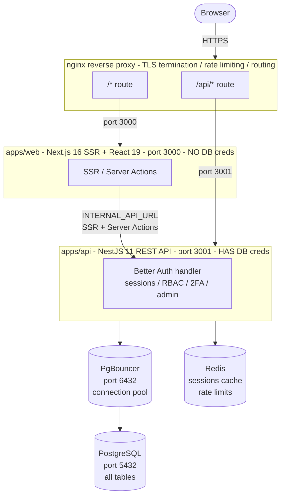
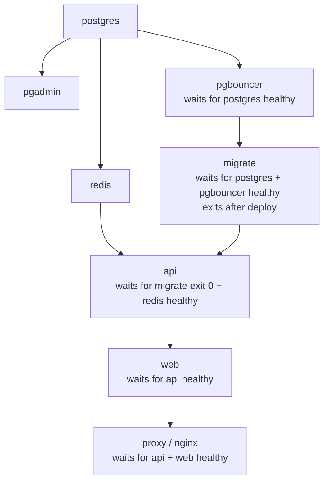
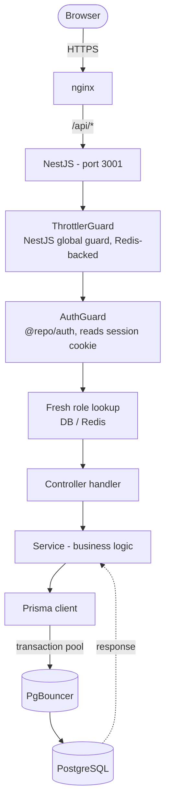
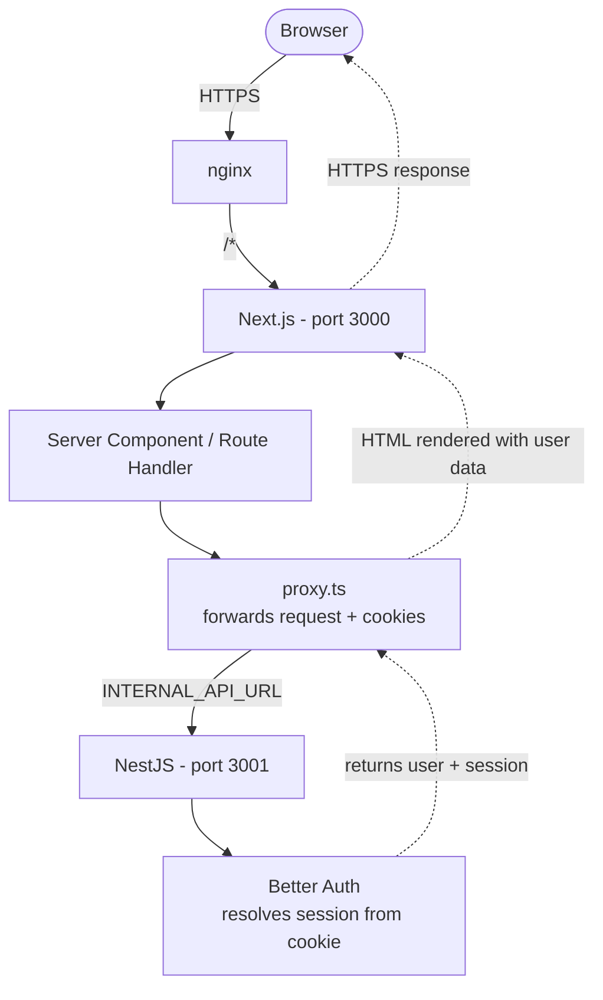
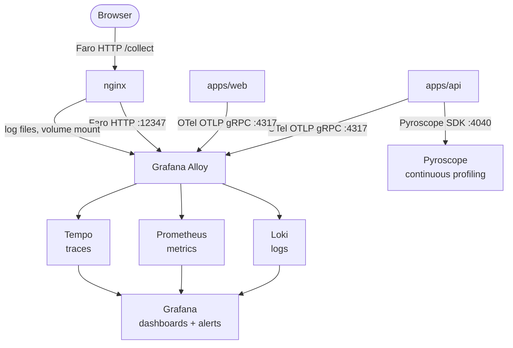

# Architecture — Template Turbo Repo

> This document describes the system architecture, design decisions, and key subsystems. It is intended for developers building on top of this template and for AI agents understanding the codebase.

---

## System diagram

---

## Docker profiles

| Profile | What runs in Docker | What runs on host |
|---------|---------------------|-------------------|
| `prod` | postgres, redis, pgadmin, pgbouncer, migrate, api, web, nginx | nothing |
| `dev` | postgres, redis, pgadmin, pgbouncer, migrate-dev, api-dev, web-dev, nginx | nothing |
| `local` | postgres, redis, pgadmin, pgbouncer, nginx | api + web (`pnpm dev`) |
| `test` | postgres-test, redis-test, migrate-test, api-test | nothing |
| `e2e` | postgres-e2e, redis-e2e, migrate-e2e, api-e2e, web-e2e, nginx-e2e | Playwright |

With `docker-compose.observability.yml` merged, the `prod`, `dev`, and `local` profiles also start: Grafana, Prometheus, Alloy, Loki, Tempo, Pyroscope, cAdvisor, Node Exporter, Postgres Exporter, Redis Exporter.

---

## Service startup order (prod)

---

## Health probes

| Service | Endpoint | Strategy |
|---------|----------|---------|
| postgres | `pg_isready -h 127.0.0.1` | TCP |
| redis | `redis-cli ping` | PONG |
| pgbouncer | TCP port check | TCP |
| api | `GET /api/health/live` | Liveness only (no deps) |
| api readiness | `GET /api/health/ready` | Checks Redis PING + Postgres SELECT 1 |
| web | `GET /` | HTTP 200 |
| nginx | `GET /healthz` | HTTP 200 |

**Liveness vs readiness:** The Docker `HEALTHCHECK` for `api` uses `/live` (no dependencies). The `/ready` endpoint is for load balancer probes — it checks Redis + Postgres and returns 503 if either is down.

---

## Request flow — authenticated API call

---

## Request flow — web SSR (server-side auth)

The web server **never** touches Postgres or Better Auth directly — always via the API proxy.

---

## Observability pipeline

---

## Security boundaries

1. **Web tier isolation:** No database credentials or auth secrets in web container. Enforced by CI guards.
2. **nginx rate limiting:** Three zones (auth, API, general) per IP. No bypass mechanism exists.
3. **Better Auth rate limits:** Per-endpoint, per-IP/user limits with Redis storage.
4. **NestJS Throttler:** Global guard, additional layer.
5. **Role hierarchy:** Admins cannot act on peers or superiors (`enforceRoleHierarchy()`).
6. **Password policy:** Min 8 chars, requires uppercase + lowercase + number + symbol.
7. **Session freshness:** Destructive operations (delete account, change email) require a session younger than `SESSION_FRESH_AGE` (15 min default).
8. **Audit trail:** All admin operations written to `auditLog`. Domain mutations via outbox.

---

## Key technical decisions

| Decision | Rationale |
|----------|-----------|
| **Prisma 7 with adapter-pg** | Native PostgreSQL driver, no libpq dependency, runs in edge environments |
| **PgBouncer transaction mode** | Reduces Postgres connection count under load; requires `DIRECT_URL` bypass for migrations |
| **Better Auth 1.6.29 pinned** | 1.7.x is ESM-only, incompatible with current CJS API setup |
| **Architecture B (secret-free web)** | Minimises blast radius; web compromise cannot access DB or sign auth tokens |
| **Redis for sessions** | Better Auth secondary storage for fast session lookups without DB round-trips |
| **Outbox pattern for domain audit** | Guarantees audit delivery even if the audit write fails (retried by poller) |
| **Three-layer rate limiting** | Defense-in-depth; each layer independently mitigates different attack vectors |
| **mkcert for local TLS** | Browser-trusted certs without any CA bundle hacks |
| **Single root .env** | One source of truth; no per-package env files; Docker and local use the same file |
