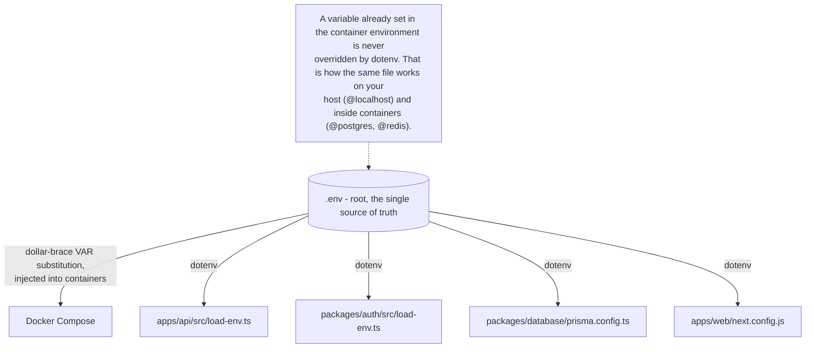
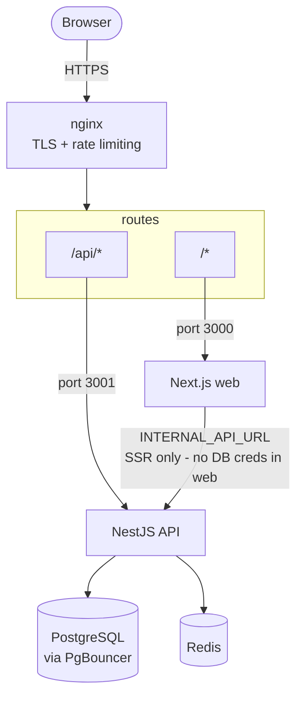
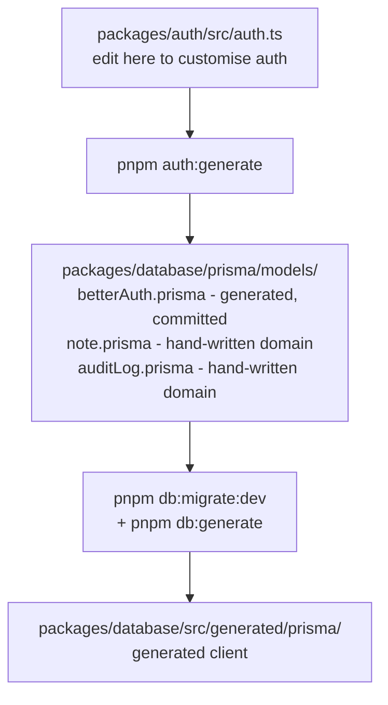

# Getting Started — Template Turbo Repo

> **New to this template?** This guide walks you through every mode of running the stack — from a quick local dev setup to a production-like Docker deployment. Read it once end-to-end; then use the [Daily Cheatsheet](#daily-cheatsheet) for day-to-day work.

---

## Table of Contents

1. [Prerequisites](#1-prerequisites)
2. [Install dependencies](#2-install-dependencies)
3. [Environment variables](#3-environment-variables)
4. [TLS certificates](#4-tls-certificates)
5. [Choose your run mode](#5-choose-your-run-mode)
6. [Observability stack](#6-observability-stack-optional)
7. [Database workflow (Prisma 7)](#7-database-workflow-prisma-7)
8. [Auth schema generation (auth:generate)](#8-auth-schema-generation--authgenerate)
9. [Seeding the admin user](#9-seeding-the-admin-user)
10. [Testing](#10-testing)
11. [Turborepo and pnpm](#11-turborepo--pnpm--useful-commands)
12. [Guards and linting](#12-guards--linting)
13. [Troubleshooting](#13-troubleshooting)
14. [Daily cheatsheet](#daily-cheatsheet)

---

## 1. Prerequisites

| Tool | Version | Notes |
|------|---------|-------|
| **Node.js** | >= 20 (tested on 22) | Required by Prisma 7 and Next.js 16 |
| **pnpm** | 11.23.0 (repo-pinned) | Use `corepack enable` — do **not** install a different version |
| **Docker Desktop** | latest | Compose v2 built in; required for all infrastructure |
| **mkcert** | latest | Highly recommended for generating trusted local TLS certs |

> **Windows users:** All Docker commands below work in PowerShell. The `k6:*` scripts use `.ps1` variants automatically.

---

## 2. Install dependencies

```bash
# activates pnpm@11.23.0 from the packageManager field
corepack enable

# installs all workspace packages
pnpm install
```

The `postinstall` hook runs `pnpm db:generate` automatically on a fresh clone.

---

## 3. Environment variables

### How it works

There is exactly **one root `.env`** — the single source of truth for both Docker Compose and local processes.



### Step-by-step setup

**1. Copy the template:**

```bash
cp .env.example .env
```

**2. Set the required values in `.env`:**

| Variable | What to set | How to generate |
|----------|-------------|----------------|
| `BETTER_AUTH_SECRET` | Random secret >=32 chars | `openssl rand -base64 32` |
| `BETTER_AUTH_URL` | Your app base URL | `https://localhost` |
| `TRUSTED_ORIGINS` | Same as `BETTER_AUTH_URL` | `https://localhost` |
| `NEXT_PUBLIC_APP_URL` | Public URL | `https://localhost` |
| `SEED_ADMIN_EMAIL` | Admin account email | `admin@yourapp.com` |
| `SEED_ADMIN_PASSWORD` | Strong password | Must pass complexity rules |
| `SEED_ADMIN_NAME` | Admin display name | `Admin` |
| `POSTGRES_PASSWORD` | Postgres password | Any strong password |
| `REDIS_PASSWORD` | Redis password | Any password |
| `RESEND_API_KEY` | Resend email API key | Required in prod; use `EMAIL_VERIFICATION=relaxed` for dev |

**3. Update connection strings to match your passwords:**

```
DATABASE_URL=postgresql://myapp:<POSTGRES_PASSWORD>@localhost:5432/myapp_db?schema=public
DIRECT_URL=postgresql://myapp:<POSTGRES_PASSWORD>@localhost:5432/myapp_db?schema=public
REDIS_URL=redis://:<REDIS_PASSWORD>@localhost:6379
```

**4. For local dev without email verification:**

```bash
# Add to .env:
EMAIL_VERIFICATION=relaxed
NODE_TLS_REJECT_UNAUTHORIZED=0   # trusts the self-signed local cert (dev only)
```

### Additional env files (copy only when needed)

| Template | Destination | Purpose |
|----------|-------------|---------|
| `.env.example` | `.env` | Main config (dev, prod, local) — always needed |
| `.env.e2e.example` | `.env.e2e` | Playwright E2E isolated dataset |
| `.env.k6.example` | `.env.k6` | k6 load testing — loosened rate limits |
| `.env.test.example` | `.env.test` | Integration tests (local run mode) |

> **Never** reuse `.env.e2e` or `.env.test` credentials in dev or production.

---

## 4. TLS certificates

Nginx requires TLS certificates. The fastest approach uses `mkcert`:

```bash
# Install the local CA (once per machine)
mkcert -install

# Generate the certificate
mkcert -key-file nginx/certs/localhost.key \
       -cert-file nginx/certs/localhost.crt \
       localhost 127.0.0.1 ::1
```

The filenames must match your `.env`:

```
NGINX_SSL_CERT_FILENAME=localhost.crt
NGINX_SSL_KEY_FILENAME=localhost.key
```

After `mkcert -install`, your browser trusts the cert without warnings. This is a one-time machine setup.

---

## 5. Choose your run mode

The stack has three Docker profiles. Pick exactly **one** at a time.

### Architecture



> **Architecture B (secret-free web):** The web container holds no database credentials and no auth signing secret. All auth operations are proxied to the API tier.

---

### Mode A — local (recommended for day-to-day development)

Infra runs in Docker. Your apps (`api` + `web`) run on your host for the fastest development experience.

**Start infra:**

```bash
docker compose --profile local up -d
```

| Docker service | Port (host) |
|---------------|------------|
| `postgres` | 5432 |
| `redis` | 6379 |
| `pgbouncer` | 6432 |
| `pgadmin` | 5050 |
| `proxy-local` (nginx) | 80 / 443 |

**Start apps:**

```bash
pnpm dev
```

This starts `apps/api` on `:3001` and `apps/web` on `:3000`.

**Access at:** `https://localhost`

**Stop:** `docker compose --profile local down`

> **Linux note:** `host.docker.internal` is already configured via `extra_hosts: host-gateway` in the compose file — no extra setup needed.

---

### Mode B — dev (Docker hot reload)

Everything in Docker. Source is volume-mounted so edits trigger hot reload inside containers.

```bash
docker compose --profile dev up --build
```

| Service | Notes |
|---------|-------|
| `api-dev` | NestJS in watch mode |
| `web-dev` | Next.js dev server |
| `proxy-dev` | nginx TLS proxy |

**Access at:** `https://localhost`

**Rebuild after dependency changes:**

```bash
docker compose --profile dev up --build --force-recreate
```

**Stop:** `docker compose --profile dev down`

> `NEXT_ALLOWED_DEV_ORIGINS=https://localhost` must be set in `.env` for the dev server to accept proxied requests.

---

### Mode C — prod (full Docker stack)

Production images built and served behind nginx.

```bash
docker compose --profile prod up --build -d
```

| Service | Notes |
|---------|-------|
| `migrate` | Runs `prisma migrate deploy` once, then exits |
| `api` | NestJS production build |
| `web` | Next.js standalone build |
| `proxy` | nginx TLS proxy |

**Startup order:** postgres -> redis -> migrate -> api -> web -> proxy

**Access at:** `https://localhost`

**Stop:** `docker compose --profile prod down`

**Clean slate:** `docker compose --profile prod down -v`

---

## 6. Observability stack (optional)

Merge `docker-compose.observability.yml` with any app profile:

```bash
# With local profile
docker compose \
  -f docker-compose.yml \
  -f docker-compose.observability.yml \
  --profile local up -d

# With prod profile
docker compose \
  -f docker-compose.yml \
  -f docker-compose.observability.yml \
  --profile prod up -d
```

| Service | URL | Purpose |
|---------|-----|---------|
| Grafana | `http://localhost:3002` | Dashboards and alerting |
| Prometheus | `http://localhost:9091` | Metrics scraping |
| Grafana Alloy | `http://localhost:12345` | OTel collector + Faro RUM |
| Loki | internal | Log aggregation |
| Tempo | internal | Distributed tracing |
| Pyroscope | internal | Continuous profiling |
| cAdvisor | internal | Container resource metrics |
| Postgres/Redis Exporters | internal | DB metrics |

**Default credentials:** `admin` / `admin` (set `GF_SECURITY_ADMIN_PASSWORD` in `.env` — rotate before production).

**Faro RUM** sends browser telemetry to `NEXT_PUBLIC_FARO_COLLECTOR_URL` — this is baked at build time; rebuild after changing it.

---

## 7. Database workflow (Prisma 7)

The Prisma client is generated to `packages/database/src/generated/prisma` (Prisma v7 — not `node_modules/.prisma`).

### Fresh environment setup (in order)

```bash
pnpm db:generate          # 1. generate the v7 client (needed before builds)
pnpm db:migrate:dev       # 2. create and apply a migration (interactive)
# or: pnpm db:push        # 2b. push schema directly (no migration file, fast)
pnpm db:seed              # 3. create the admin (API must be running first)
pnpm db:studio            # 4. optional — inspect data
```

### Command reference

| Command | When to use |
|---------|-------------|
| `pnpm db:generate` | After any `.prisma` file change, after `auth:generate`, after fresh clone |
| `pnpm db:migrate:dev` | When adding/changing models — creates a migration file |
| `pnpm db:migrate:deploy` | CI/production — applies existing migrations only |
| `pnpm db:push` | Fast local iteration — no migration file, resets on conflict |
| `pnpm db:seed` | Initial admin setup — idempotent |
| `pnpm db:studio` | Visual data inspection |

---

## 8. Auth schema generation — auth:generate

This command bridges Better Auth and Prisma.

### What it does

```bash
pnpm auth:generate
```

1. Reads your Better Auth config from `packages/auth/src/auth.ts`
2. Runs `@better-auth/cli generate` to introspect all active plugins
3. Writes generated Prisma models to `packages/database/prisma/models/betterAuth.prisma`
4. Prints a reminder to run `pnpm db:migrate:dev` + `pnpm db:generate` next

### Why it exists

Better Auth manages its own database tables (users, sessions, accounts, verifications, 2FA, JWKS, rate limits). The CLI introspects your `auth.ts` config and generates these Prisma models automatically — you never hand-write them.

The generated file is **committed to the repo**. The CLI only **appends** missing models/fields, so hand-written additions (custom indexes, extra fields) are preserved on regeneration.

### Schema relationship



### When to run it

- When you add, remove, or configure a Better Auth plugin in `auth.ts`
- When you change plugin options that affect the DB schema (e.g. enabling 2FA, adding OAuth)
- To verify the schema is in sync with your config

### Full workflow after changing auth.ts

```bash
pnpm auth:generate        # 1. sync betterAuth.prisma
pnpm db:migrate:dev       # 2. create migration from schema diff
pnpm db:generate          # 3. rebuild Prisma client
```

> **Important:** To customise auth behaviour, edit `packages/auth/src/auth.ts` — not `betterAuth.prisma` directly.

---

## 9. Seeding the admin user

The seed script creates the superAdmin via the real Better Auth sign-up endpoint (proper password hashing).

### Prerequisites

The **API must be running and healthy** before seeding:

- Mode A: `docker compose --profile local up -d` + `pnpm dev`
- Mode B: `docker compose --profile dev up --build`
- Mode C: `docker compose --profile prod up --build -d`

### Run

```bash
pnpm db:seed
```

The seed is **idempotent** — an existing admin with the same email is skipped or promoted to superAdmin if its role is missing.

### Required env vars

```
SEED_ADMIN_EMAIL=admin@yourapp.com
SEED_ADMIN_PASSWORD=YourStrongPassword123!
SEED_ADMIN_NAME=Admin
BETTER_AUTH_URL=https://localhost
DATABASE_URL=postgresql://...
NODE_TLS_REJECT_UNAUTHORIZED=0   # dev only — trusts the self-signed cert
```

---

## 10. Testing

### Suite matrix

| Suite | Needs | Env file | Command |
|-------|-------|----------|---------|
| Unit | Nothing | Your `.env` | `pnpm test` |
| Integration (Docker) | `test` profile | Inline compose defaults | Option A |
| Integration (local) | Local Postgres + Redis | `.env.test` | Option B |
| E2E (Playwright) | `e2e` profile | `.env.e2e` | Option C |
| k6 load | Any running stack | `.env.k6` (host-run only) | Option D |

### A — Unit tests

```bash
pnpm test
```

### B — Integration tests (Docker, recommended)

```bash
docker compose --profile test up --build -d
docker wait template-turbo-repo-api-test-1
docker compose --profile test logs api-test
docker compose --profile test down
```

> Do NOT use `--abort-on-container-exit`. Use detached + `docker wait`.

### C — Integration tests (local)

```bash
cp .env.test.example .env.test
cp .env.test .env            # WARNING: tests wipe data
docker compose --profile local up -d
pnpm --filter api test:integration
```

### D — E2E tests (Playwright)

```bash
cp .env.e2e.example .env.e2e
docker compose --env-file .env.e2e --profile e2e up -d --build
pnpm --filter web exec playwright install chromium
pnpm --filter web test:e2e
docker compose --env-file .env.e2e --profile e2e down -v
```

### E — k6 load tests

```bash
# Against prod stack
docker compose --profile prod up --build -d
pnpm k6:smoke
pnpm k6:load

# Against host-run apps
cp .env.k6.example .env.k6
# PowerShell: ='true'; pnpm dev
# bash:       K6_TESTING=true pnpm dev
pnpm k6:load
```

---

## 11. Turborepo & pnpm — useful commands

### Root scripts

| Command | What it does |
|---------|-------------|
| `pnpm dev` | Start all apps + package watchers |
| `pnpm build` | Build everything |
| `pnpm start` | Start production builds |
| `pnpm lint` | ESLint across all packages |
| `pnpm typecheck` | TypeScript type checking |
| `pnpm format` | Prettier on all `*.{ts,tsx}` |

### Scoped with `--filter`

```bash
pnpm --filter api dev
pnpm --filter web dev
pnpm --filter api... dev          # api AND all its dependencies
pnpm --filter @repo/database db:generate
pnpm turbo run build --dry        # plan without executing
```

---

## 12. Guards & linting

```bash
pnpm guard:web-secrets          # ensures web tier has NO DB/auth secrets
pnpm guard:web-auth-imports     # ensures web tier doesn't import server-only auth
pnpm lint
pnpm typecheck
```

---

## 13. Troubleshooting

| Symptom | Fix |
|---------|-----|
| `Missing required environment variable: X` | `.env` missing `X` or process not restarted |
| `ECONNREFUSED` on seed | API not running — wait for healthy, retry |
| `Better Auth sign-up failed: 500` | API env incomplete — check API logs |
| Integration tests refuse to boot on OTel keys | Re-copy from `.env.test.example` (needs `OTEL_SDK_DISABLED=true`) |
| `test` profile exits immediately | Used `--abort-on-container-exit` — use detached + `docker wait` |
| Port `3001` in use | Kill old process: `Get-NetTCPConnection -LocalPort 3001` |
| `host.docker.internal` not resolving (Linux) | Already handled by `extra_hosts: host-gateway` — pull latest compose |
| Web on port `3001` locally | `next.config.js` drops root `PORT` — restart web dev server |
| Prisma `client password must be a string` | `DATABASE_URL` missing or empty |
| Generated client missing | Run `pnpm db:generate` |
| Browser TLS warning | Run `mkcert -install` to trust the local CA |
| nginx startup failure | Check cert files exist in `nginx/certs/` with names matching `.env` |
| Grafana unavailable | Include `-f docker-compose.observability.yml` in the command |

---

## Daily cheatsheet

```bash
# Setup (first time)
corepack enable && pnpm install
cp .env.example .env
mkcert -install
mkcert -key-file nginx/certs/localhost.key -cert-file nginx/certs/localhost.crt localhost 127.0.0.1
pnpm db:generate && pnpm db:migrate:dev

# Local mode (recommended)
docker compose --profile local up -d
pnpm dev
pnpm db:seed   # first run only

# Full Docker dev (hot reload)
docker compose --profile dev up --build

# Full Docker prod
docker compose --profile prod up --build -d

# With observability (add to any mode)
docker compose -f docker-compose.yml -f docker-compose.observability.yml --profile local up -d

# Auth schema sync (after changing auth.ts)
pnpm auth:generate && pnpm db:migrate:dev && pnpm db:generate

# Testing
pnpm test
docker compose --profile test up -d --build && docker wait template-turbo-repo-api-test-1
pnpm --filter web test:e2e

# Quality gates
pnpm lint && pnpm typecheck && pnpm guard:web-secrets
```
