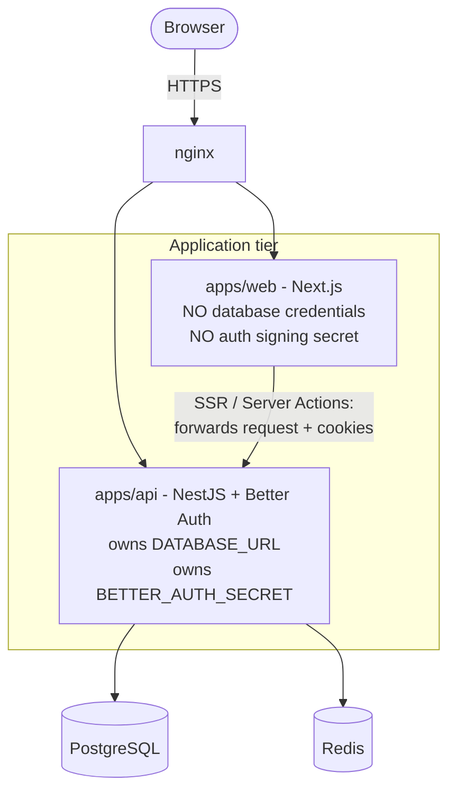
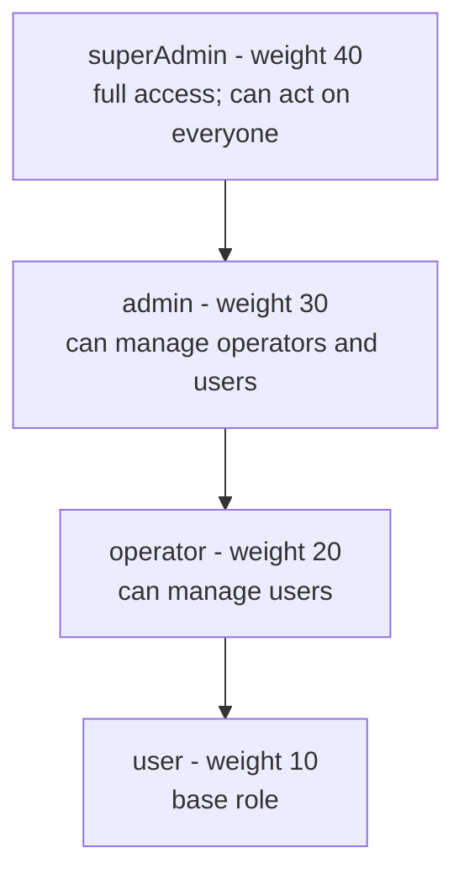
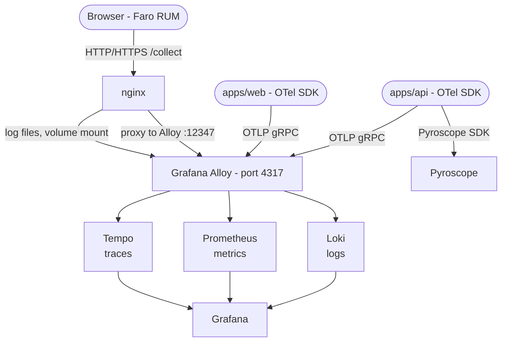
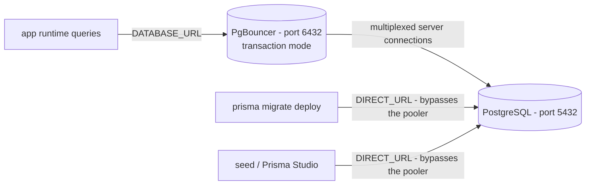

# Developer Guide — Template Turbo Repo

> Deep-dive reference for developers building on top of this template. Covers architecture decisions, monorepo structure, extending the codebase, and the LLM wiki.

---

## Table of Contents

1. [Monorepo structure](#1-monorepo-structure)
2. [Apps](#2-apps)
3. [Packages](#3-packages)
4. [Architecture B — secret-free web tier](#4-architecture-b--secret-free-web-tier)
5. [Authentication deep-dive](#5-authentication-deep-dive)
6. [Role-based access control (RBAC)](#6-role-based-access-control-rbac)
7. [Rate limiting — three layers](#7-rate-limiting--three-layers)
8. [Audit logging — two planes](#8-audit-logging--two-planes)
9. [Observability pipeline](#9-observability-pipeline)
10. [Database and Prisma 7](#10-database-and-prisma-7)
11. [Extending the template](#11-extending-the-template)
12. [LLM wiki — for AI agents](#12-llm-wiki--for-ai-agents)
13. [Key invariants](#13-key-invariants)

---

## 1. Monorepo structure

```text
template-turbo-repo/
├── apps/
│   ├── api/                      NestJS REST API + Better Auth handler
│   │   ├── src/                  modules, guards, interceptors
│   │   └── test/                 integration tests
│   ├── web/                      Next.js 16 App Router frontend
│   │   ├── src/                  app routes, proxy.ts, lib, server actions
│   │   ├── e2e/                  Playwright specs
│   │   └── public/               static assets
│   └── migrate/                  migration runner container
│                                  (prisma migrate deploy, then exits)
│
├── packages/
│   ├── auth/                     @repo/auth - Better Auth config, RBAC,
│   │   ├── src/                    plugins, audit hooks
│   │   ├── scripts/
│   │   └── test/
│   ├── database/                 @repo/database - Prisma client, schema,
│   │   ├── prisma/                 migrations, hand-written models
│   │   ├── src/
│   │   └── test/
│   ├── roles/                    @repo/roles - role utilities,
│   │   └── src/                    SERVER_ACTION_SCOPES
│   ├── api/                      @repo/api - shared TS types (contracts)
│   │   └── src/
│   ├── ui/                       @repo/ui - shared React components
│   │   └── src/
│   ├── observability/            @repo/observability - OTel + pino helpers
│   │   └── src/
│   ├── eslint-config/            @repo/eslint-config
│   ├── jest-config/              @repo/jest-config
│   │   └── src/
│   ├── tailwind-config/          @repo/tailwind-config
│   └── typescript-config/        @repo/typescript-config
│
├── k6/                           load test suites
│   ├── suites/                   smoke, load, stress, spike, soak,
│   │                               capacity, edge-cases
│   ├── scenarios/                one file per user flow
│   ├── helpers/                  auth, data, http, setup, summary
│   ├── tests/                    runner contract test
│   └── results/                  run artifacts (gitignored)
│
├── observability/                Grafana stack configuration
│   ├── alloy/                    OTel collector + Faro receiver
│   ├── prometheus/               scrape config, recording rules, alerts/
│   ├── grafana/
│   │   ├── dashboards/           6 provisioned dashboards (JSON)
│   │   └── provisioning/         datasources + dashboard providers
│   ├── loki/                     log aggregation
│   ├── tempo/                    distributed tracing
│   └── pyroscope/                continuous profiling
│
├── nginx/                        reverse proxy
│   ├── certs/                    local TLS certs (mkcert)
│   └── nginx.conf                zones, upstreams, routing
│
├── pgbouncer/                    connection pooler config
├── patches/                      pnpm patches (better-auth 1.6.29)
├── scripts/                      architecture guards, benchmark
│                                   reporter, scaffold + tests/
├── docs/
│   ├── wiki/                     LLM knowledge base
│   │   ├── invariants/           the non-negotiable constraints
│   │   ├── flows/                hop narratives
│   │   ├── subsystems/           file-area owners
│   │   ├── workflows/            step-by-step change guides
│   │   ├── extension/            template extension patterns
│   │   ├── reference/            test matrix, ports, rate limits
│   │   ├── research/             expiring benchmarks
│   │   ├── decisions/            ADRs
│   │   └── _meta/                wiki maintenance rules
│   ├── testing/                  test strategy docs
│   └── screenshots/              capacity-report evidence
│
├── docker-compose.yml            app + infra profiles
├── docker-compose.observability.yml  monitoring overlay
├── turbo.json                    task graph, caching, env passthrough
└── pnpm-workspace.yaml           workspace + version catalog
```

The full tree is far larger than this (Prisma migrations, k6 suites and every
source module). Generate it any time with:

```bash
sh generate_mini_tree.sh          # raw directory list
sh generate_tree.sh               # nested tree with files
```

Both scripts exclude `node_modules`, `.turbo`, `dist`, `.next`, `build`, `.git`
and `__pycache__`.

**Workspace pinning** (`pnpm-workspace.yaml` catalog):

| Package | Pinned version |
|---------|---------------|
| `better-auth` | 1.6.29 |
| `typescript` | 5.9.3 |
| `@prisma/client` | ^7.9.1 |

Better Auth 1.6.29 is pinned because 1.7.x switched to ESM-only which is incompatible with the current CJS API setup. A patch file (`patches/better-auth@1.6.29.patch`) is applied on install.

---

## 2. Apps

### apps/api — NestJS REST API

**Framework:** NestJS 11 with Express adapter  
**Port:** 3001 (`PORT` env var)  
**Entry:** `src/main.ts`

Key modules:

| Module | Route prefix | Purpose |
|--------|-------------|---------|
| `AppModule` | — | Root: ConfigModule (Joi validation), RedisModule, ThrottlerModule, AuthModule |
| `HealthModule` | `/api/health` | Liveness (`/live`) + readiness (`/ready`) probes |
| `AuthModule` | `/api/auth/*` | Better Auth handler — all auth endpoints |
| `NotesModule` | `/api/notes` | Authenticated CRUD (demo domain) |
| `AuditModule` | `/api/audit-logs`, `/api/admin/audit-logs` | Audit trail read/write |
| `UsersModule` | `/api/users/me/*` | Role and permissions endpoints |
| `LinksModule` | `/api/links` | Public read-only in-memory link store |
| `ServerActionRateLimitModule` | `/api/rate-limit/check` | Server action rate limit checks |

**Guards:** `ThrottlerGuard` is global (NestJS-level, Redis-backed). `AuthGuard` from `@repo/auth` is applied at the controller level — routes marked `@AllowAnonymous()` bypass it.

**Validation:** Joi schema in `app.module.ts` fails the process at boot if any required env var is missing.

---

### apps/web — Next.js 16

**Framework:** Next.js 16 App Router, React 19  
**Port:** 3000 (host), or whatever `WEB_PORT` is injected by Compose  
**Entry:** `src/app/layout.tsx`

Key directories:

| Path | Purpose |
|------|---------|
| `src/app/auth/` | Login, sign-up, password reset, 2FA pages |
| `src/app/dashboard/` | Authenticated dashboard, notes, settings |
| `src/app/admin/` | Admin panel (user management, audit logs, impersonation) |
| `src/proxy.ts` | HTTP gateway — forwards requests to API with cookies (Architecture B bridge) |
| `src/lib/` | Better Auth client, server actions, validation |
| `e2e/` | Playwright E2E tests |

**No database access:** The web container holds no `DATABASE_URL` or `BETTER_AUTH_SECRET`. All authenticated server-side operations forward requests to the API via `INTERNAL_API_URL`.

---

### apps/migrate — Migration runner

A minimal container that runs `prisma migrate deploy` then exits. Used in Docker Compose `prod` and `dev` profiles to ensure migrations run before the API starts.

---

## 3. Packages

### @repo/auth

The heart of authentication. Contains:

- **`src/server/auth.ts`** — Better Auth instance configuration. **Edit this to customise auth.**
- **`src/server/audit-plugin.ts`** — Custom plugin intercepting admin endpoints for audit trail
- **`src/server/database-hooks.ts`** — Better Auth database hooks (cache invalidation, etc.)
- **`src/server/hierarchy.ts`** — Role hierarchy enforcement (prevents acting on peers/superiors)
- **`src/server/pending-storage.ts`** — Redis-backed pending operations store
- **`src/shared/permissions.ts`** — RBAC access control definitions
- **`src/shared/roles.ts`** — Role constants and utilities
- **`src/shared/password-policy.ts`** — Password complexity rules

**Active Better Auth plugins:**

| Plugin | Purpose |
|--------|---------|
| `twoFactor` | TOTP (authenticator app) + OTP (email) + backup codes |
| `admin` | User management, role assignment, ban, impersonation |
| `jwt` | JWT tokens (ES256, 30min expiry, 30-day rotation) |
| `auditLogPlugin` | Custom: intercepts admin mutations for audit trail |
| `nextCookies` | Set-Cookie header forwarding for Next.js Server Actions |

---

### @repo/database

- **`src/client.ts`** — PrismaClient singleton with `@prisma/adapter-pg` (pooled connection via PgBouncer), configurable pool
- **`src/seed.ts`** — Admin seeding script
- **`prisma/schema.prisma`** — Prisma generator + datasource
- **`prisma/models/betterAuth.prisma`** — Generated Better Auth tables (regenerate with `pnpm auth:generate`)
- **`prisma/models/note.prisma`** — Domain model (Notes demo)
- **`prisma/models/auditLog.prisma`** — Audit log table

**Prisma v7 key change:** The client generates to `packages/database/src/generated/prisma` (not `node_modules/.prisma`). Run `pnpm db:generate` after any schema change.

---

### @repo/roles

Shared role utilities used by both API and auth tiers:

- `BaseRole` type: `user` | `operator` | `admin` | `superAdmin`
- Role weight map for hierarchy comparisons
- `parseRoles()`, `serializeRoles()`, `getMaxRoleWeight()`, `getPrimaryRole()`
- `hasRole()`, `hasAdminRole()`, `hasSuperAdminRole()`, `canActOn()`
- `SERVER_ACTION_SCOPES` — closed allowlist of rate-limited web action scopes

---

### @repo/observability

OpenTelemetry and Pino logging helpers used by both `apps/api` and `apps/web`.

---

## 4. Architecture B — secret-free web tier

This is the most important architectural decision in the template.

**The rule:** The web tier (Next.js) holds **no** database credentials and **no** auth signing secret.

**How it works:**



When the web server needs auth information (SSR, Server Actions):
1. It forwards the request with cookies to `INTERNAL_API_URL` (the API container)
2. The API resolves the session from DB/Redis
3. Returns the session/user data to the web tier

The web tier **never** touches Postgres or Redis directly.

**Guards that enforce this:**
- `pnpm guard:web-secrets` — fails CI if `DATABASE_URL`, `BETTER_AUTH_SECRET`, or PG variables appear in the web tier
- `pnpm guard:web-auth-imports` — fails CI if server-only auth code is imported in the web tier

---

## 5. Authentication deep-dive

### Session lifecycle

1. Browser → `POST /api/auth/sign-in/email`
2. Better Auth validates credentials against `account` table
3. If 2FA enabled → partial session, requires TOTP/OTP/backup code
4. Sets HTTP-only session cookie
5. Session stored in `session` table (DB-backed) + Redis secondary storage

### OAuth (Google / GitHub)

1. `GET /api/auth/sign-in/social/google` → redirect to Google
2. Google → `GET /api/auth/callback/google` with code
3. Better Auth exchanges code, fetches user info
4. `accountLinking` — merges with existing user by email if configured
5. Sets session cookie

### 2FA flow

1. After sign-in → `twoFactor` plugin intercepts if enabled
2. User verifies via TOTP (authenticator app, 6 digits, 30s) or OTP (email, 3 min)
3. Backup codes available as fallback (10 codes, 10 chars each)
4. `trustDevice` cookie remembers device for configured period

### Session configuration

| Variable | Default | Purpose |
|----------|---------|---------|
| `SESSION_EXPIRES_IN` | 604800 (7d) | Session lifetime |
| `SESSION_UPDATE_AGE` | 86400 (1d) | Session refresh interval |
| `SESSION_FRESH_AGE` | 900 (15m) | Fresh session requirement for destructive ops |

---

## 6. Role-based access control (RBAC)

### Role hierarchy



`enforceRoleHierarchy()` in `packages/auth/src/server/hierarchy.ts` blocks any
attempt to act on a peer or a superior - an `admin` cannot edit another `admin`.

### Permission system

Resources and actions defined in `packages/auth/src/shared/permissions.ts`:

- **notes:** `create`, `read`, `update`, `delete`
- **settings:** `read`, `updateDisplayName`, `toggleTheme`, `runLabs`, `deleteAccount`

Grant roles (additional permission sets):
- `settingsThemeGrant` — grants `settings:toggleTheme`
- `settingsLabsGrant` — grants `settings:runLabs`

### Fresh role invariant

**Every request re-reads the role from the database.** Role verdicts are never trusted from the session cookie because:
- The session snapshot may be stale (role changed after login)
- Impersonation must reflect the correct effective user

The `GET /api/users/me/role` endpoint returns the current DB role for the UI to use.

---

## 7. Rate limiting — three layers

The stack enforces rate limiting at three independent layers with no bypass mechanism.

### Layer 1 — nginx (edge)

IP-wide flood protection. Configured via `.env`:

| Zone | Variable | Default |
|------|----------|---------|
| Auth endpoints | `NGINX_AUTH_RATE` | `300r/m` |
| API endpoints | `NGINX_API_RATE` | `10r/s` |
| General | `NGINX_GENERAL_RATE` | `30r/s` |
| Connections | `NGINX_CONN_LIMIT` | `20` |

### Layer 2 — Better Auth (per-endpoint)

Custom rate rules in `packages/auth/src/server/auth.ts`:

| Category | Window | Max |
|----------|--------|-----|
| `sign-in` | 60s | 5 |
| `sign-up` | 60s | 3 (`RATE_LIMIT_SIGNUP_MAX`) |
| `get-session` | 60s | 300 |
| `delete-user` | 60s | 2 |
| Admin mutations | 60s | 3-5 |

### Layer 3 — NestJS Throttler (global)

Global per-IP guard: `THROTTLE_TTL_MS` (default 60s) / `THROTTLE_LIMIT` (default 200).

### Server Action Rate Limiter

Additional Redis-backed limiter for web app mutations. Scopes defined in `@repo/roles`'s `SERVER_ACTION_SCOPES`:
- `notes:create-note`, `notes:update-note`, `notes:delete-note`
- `settings:update-display-name`, `settings:toggle-theme-preference`, etc.

---

## 8. Audit logging — two planes

### Plane 1 — Synchronous (auth events)

Auth-tier admin operations (`set-role`, `ban-user`, `impersonate-user`, etc.) write audit records inline, synchronously, via the `auditLogPlugin`. Best-effort: swallowed on failure, no retry.

### Plane 2 — Outbox (domain events)

Domain mutations (notes create/update/delete, settings changes) enqueue audit events in the **same database transaction** as the business mutation. A background poller drains the queue within 20s (well within the 30s graceful shutdown window).

**Key distinction:** Never put high-volume domain writes in the sync plane, and never put privilege-escalation events in the async plane.

---

## 9. Observability pipeline



**Pyroscope** receives continuous profiling data directly from the API.

**Host-run apps** (local mode): The OTel SDK rewrites `alloy:4317` to `localhost:4317` automatically when not running inside Docker (detected by absence of `/.dockerenv`).

**Key env vars:**

| Variable | Purpose |
|----------|---------|
| `OTEL_SDK_DISABLED` | Set `true` to disable all telemetry (test/integration profiles) |
| `OTEL_EXPORTER_OTLP_ENDPOINT` | Alloy gRPC endpoint (default `http://alloy:4317`) |
| `OTEL_SERVICE_NAME_API` / `_WEB` | Service identity per tier |
| `OTEL_SERVICE_NAMESPACE` | Groups services in Grafana |
| `GIT_SHA` | Version label (used as `OTEL_SERVICE_VERSION`) |
| `NEXT_PUBLIC_FARO_COLLECTOR_URL` | Browser RUM endpoint (baked at build time) |

---

## 10. Database and Prisma 7

### Connection routing



**Why two URLs?** PgBouncer transaction mode breaks advisory locks and prepared statements used by migrations. Migrations and Prisma Studio always bypass the pooler via `DIRECT_URL`.

### Pool math

```
API_WORKERS * DATABASE_POOL_MAX <= PGBOUNCER_MAX_CLIENT_CONN
PGBOUNCER_DEFAULT_POOL_SIZE + PGBOUNCER_RESERVE_POOL_SIZE < POSTGRES_MAX_CONNECTIONS
```

Default production values (safe for a single-container setup):
- `API_WORKERS=1`, `DATABASE_POOL_MAX=10`
- `PGBOUNCER_DEFAULT_POOL_SIZE=25`, `PGBOUNCER_RESERVE_POOL_SIZE=5`
- `POSTGRES_MAX_CONNECTIONS=200`

### Database tables

| Table | Source | Purpose |
|-------|--------|---------|
| `user` | Better Auth (generated) | User accounts |
| `session` | Better Auth (generated) | Active sessions |
| `account` | Better Auth (generated) | OAuth accounts |
| `verification` | Better Auth (generated) | Email verification tokens |
| `twoFactor` | Better Auth (generated) | TOTP secrets + backup codes |
| `rateLimit` | Better Auth (generated) | DB-backed rate limit counters |
| `jwks` | Better Auth (generated) | JWT key pairs |
| `note` | Hand-written | Demo domain model |
| `auditLog` | Hand-written | Audit trail |

---

## 11. Extending the template

### Adding a new domain module

The canonical example is the Notes module. Follow this pattern:

1. **Prisma model:** Add to `packages/database/prisma/models/<model>.prisma`
2. **Migration:** `pnpm db:migrate:dev`
3. **Client rebuild:** `pnpm db:generate`
4. **API module:** Create `apps/api/src/<domain>/` with controller, service, module, DTOs
5. **Audit:** Call `auditWriter.record()` for mutations (outbox plane)
6. **RBAC:** Define permissions in `packages/auth/src/shared/permissions.ts` if needed
7. **Web:** Add server actions and pages under `apps/web/src/app/dashboard/<domain>/`

See `docs/wiki/extension/notes-canonical-example.md` for the full vertical example.

### Modifying auth

1. Edit `packages/auth/src/server/auth.ts`
2. `pnpm auth:generate` → updates `betterAuth.prisma`
3. `pnpm db:migrate:dev` → creates migration
4. `pnpm db:generate` → rebuilds Prisma client

See `docs/wiki/workflows/change-auth.md` for the complete workflow.

### Adding environment variables

1. Add to `.env.example` with a comment explaining purpose
2. Add to the appropriate validator (`app.module.ts` Joi schema for API-required vars)
3. Add to `turbo.json` `passThroughEnv` for the tasks that need it
4. Add to `docs/wiki/subsystems/env-config.md` add-var checklist

---

## 12. LLM wiki — for AI agents

The `docs/wiki/` directory is a structured knowledge base designed for AI agents (Claude, GPT, Gemini, etc.) working on this codebase.

### Purpose

The wiki acts as AI memory and a context router — it does NOT duplicate code, it describes **where** the code lives and **why** decisions were made.

### Structure

```
docs/wiki/
+-- 00-INDEX.md          Entry point + task router (start here)
+-- 00-GLOSSARY.md       Homonym pairs (e.g. "effective vs session user")
+-- invariants/          10 normative constraints (the non-negotiables)
+-- flows/               Hop narratives (auth flow, API flow, migration flow, etc.)
+-- subsystems/          File-area owners (who owns what)
+-- workflows/           Step-by-step change guides
+-- extension/           Template extension patterns
+-- reference/           Test matrix and other references
+-- research/            Expiring performance benchmarks
+-- decisions/           Architecture decision records
+-- _meta/               Wiki maintenance instructions
```

### How to use it as an AI agent

Follow the **5-step first-read path** from `00-INDEX.md`:

1. Read `AGENTS.md` (30s) — identity + invariants
2. Read `docs/wiki/00-INDEX.md` — identify your task row (T1–T10)
3. Read only the 2–4 invariants bound to your task
4. Read the task route flows + subsystems + workflows
5. Open code at exact paths named by the flows

### Task router

| Task | Use when |
|------|----------|
| T1 — Add domain via Notes seam | Adding a new CRUD feature |
| T2 — Modify auth and session | Changing Better Auth config, sessions, OAuth |
| T3 — Add DB model and migration | New Prisma model, migration, pool changes |
| T4 — Admin UI plus role and permission | New role, permission, admin UI feature |
| T5 — Rate limit edge and app and action | New rate limit, nginx zone, server action limit |
| T6 — Observability SDK and pipeline | OTel changes, new metrics, Grafana dashboards |
| T7 — Docker and env and profiles | New Docker service, env var, compose profile |
| T8 — Debug prod and audit | Production debugging, audit DLQ |
| T9 — Perf cluster and pool | Capacity testing, pool tuning, k6 analysis |
| T10 — Security hardening | Auth boundaries, role hierarchy, RBAC |

### Connecting your AI agent to the wiki

When using an AI coding assistant (Cursor, GitHub Copilot, Claude, etc.):

1. Point the agent at `docs/wiki/00-INDEX.md` as its knowledge base entry point
2. The `AGENTS.md` file in the root is automatically loaded by most agent configurations
3. The `.cursorrules`, `CLAUDE.md`, `CODEX.md` files contain agent-specific instructions

---

## 13. Key invariants

These 10 constraints are non-negotiable. Violating them causes bugs that are difficult to diagnose:

1. **Architecture B** — web tier has no DB/auth secrets; all auth via API proxy
2. **Fresh role** — role verdicts always re-read from DB, never trust session snapshot
3. **Request context per request** — no ALS leak between requests; `@Session()` captured once at emit
4. **Pooler for runtime, direct for migrations** — `DATABASE_URL` → PgBouncer; `DIRECT_URL` → Postgres
5. **Two audit planes** — sync for auth events, outbox for domain events
6. **Three rate limit layers, no bypass** — nginx + Better Auth + NestJS Throttler all active
7. **Liveness vs readiness split** — liveness has no deps; readiness checks Redis + Postgres
8. **Observable by default** — normalized routes, per-worker instance ID, fail-open telemetry
9. **Single env source, fail-fast** — one `.env`, Joi validation at boot, public values baked vs runtime secrets
10. **Presentational is not enforcement** — UI hiding is not access control; API always re-checks

Full details: `docs/wiki/invariants/`
